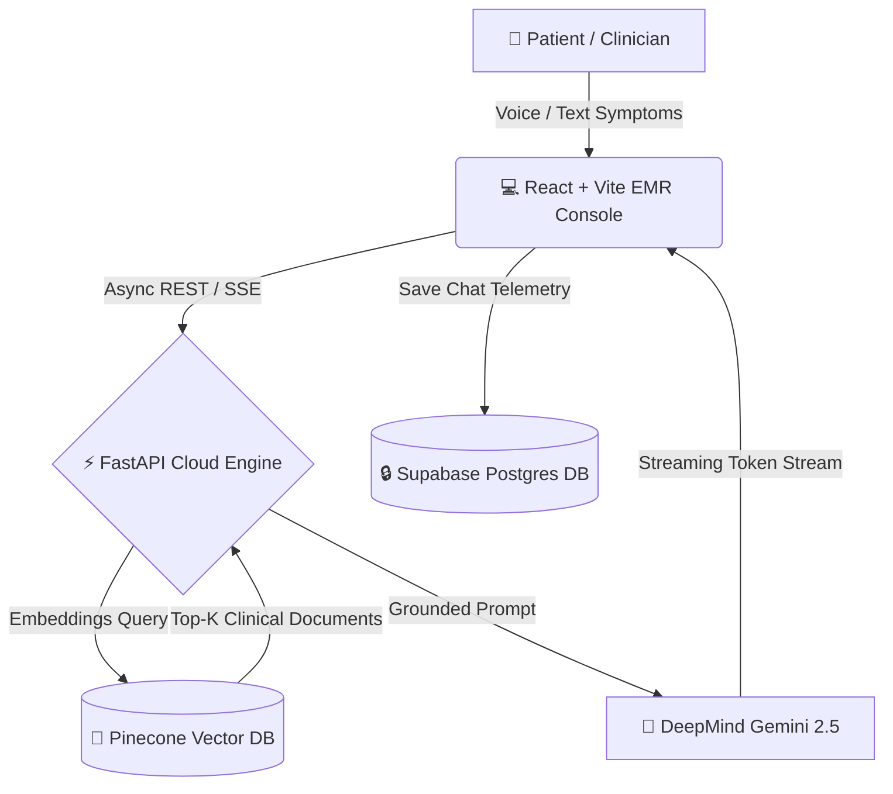

<div align="center">

# 🩺 Dr. Pulse AI — Clinical Frontend Console

**Autonomous Medical Consultation & Diagnostic RAG Terminal Powered by DeepMind Gemini 2.5**

[](https://react.dev)
[](https://www.typescriptlang.org)
[](https://vitejs.dev)
[](https://tailwindcss.com)
[](https://pulse-ai-frontend-5b19.vercel.app)

[Live Web Demo](https://pulse-ai-frontend-5b19.vercel.app/dashboard) • [Backend API Repo](https://github.com/KRIWAL21/PULSE-AI-Backend) • [Report Bug](https://github.com/KRIWAL21/PulseAI-FRONTEND/issues)

</div>

---

## 🏥 Executive Overview

**Dr. Pulse AI** is an enterprise-grade medical physician interface engineered to replace generic AI chatbots with a clinical consultation environment modeled after modern Electronic Medical Record (EMR) systems (Mayo Clinic, Epic, Doximity). 

Unlike standard chat applications, Dr. Pulse grounds every diagnostic response in verified clinical literature via a **Retrieval-Augmented Generation (RAG v2)** pipeline, displaying exact source document citations and supporting real-time audio symptom ingestion.

---

## ✨ Key Capabilities

* 🩺 **Physician-Grade Aesthetics:** Styled in curated **Clinical Teal (`#0d9488`) & Hospital Slate (`#06b6d4`)** with high-contrast EMR typography and consultation watermarks.
* 📚 **Verified RAG Grounding:** Every AI consultation bubble displays an interactive accordion of the exact medical PDFs and journal papers referenced to eliminate hallucinations.
* 🎙️ **Real-Time Clinical Speech Ingestion:** Integrated Web Speech API allows clinicians or patients to record verbal symptom descriptions directly into the diagnostic engine.
* ⚡ **Zero-Latency Streaming Inference:** Utilizes Server-Sent Events (SSE) and asynchronous streaming to render tokens instantly with custom blinking cursors.
* 🛡️ **Encrypted Patient Memory:** Full user authentication, profile telemetry, and persistent consultation histories powered by **Supabase Cloud**.
* 💡 **Interactive Medical Chart Grid:** Welcome hero screen equipped with quick-action diagnostic triage cards.

---

## 📐 System Architecture Flow



---

## 🛠️ Technology Stack

| Pillar | Technology | Role |
| :--- | :--- | :--- |
| **Core Framework** | React 18 + TypeScript | Component reactivity and strict type safety |
| **Build & Tooling** | Vite 6 | Ultra-fast Hot Module Replacement (HMR) and bundling |
| **Styling & UI** | Vanilla CSS + Tailwind Tokens | Custom EMR glassmorphism, animations, and clinical palettes |
| **State & Auth** | Context API + Supabase Client | Persistent session management and real-time synchronization |
| **Markdown Rendering**| `react-markdown` + `remark-gfm` | Safe formatting of clinical notes, tables, and lists |
| **Deployment** | Vercel Edge Network | Global CDN and automated CI/CD pipeline |

---

## 🚀 Local Development Setup

### Prerequisites
* **Node.js** `>= 18.0.0`
* **npm** or **pnpm**

### 1. Clone Repository
```bash
git clone https://github.com/KRIWAL21/PulseAI-FRONTEND.git
cd PulseAI-FRONTEND
```

### 2. Install Dependencies
```bash
npm install
```

### 3. Configure Environment Variables
Create a `.env` file in the root directory:
```env
VITE_API_BASE_URL="http://localhost:8000"
```

### 4. Launch Clinical Dev Server
```bash
npm run dev
```
Open [http://localhost:5173](http://localhost:5173) in your browser.

---

## ⚠️ Medical Disclaimer

*Dr. Pulse AI is an advanced educational and clinical diagnostic support prototype. It does not constitute formal medical advice, definitive diagnosis, or prescriptive treatment. Always consult a certified healthcare professional before making clinical decisions.*

<div align="center">
  <p>Engineered with ❤️ by <a href="https://github.com/KRIWAL21">KRIWAL21</a></p>
</div>
